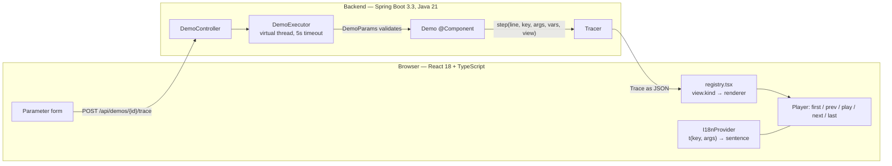

# Java and Algorithms Fundamentals

An interactive web app that shows Java running, step by step. You pick a demo, set its
parameters, press run, and watch the algorithm execute: the line that is running, the data
structure changing, the variables at that instant, and a sentence explaining the decision
that was just taken.

The Java is real. A Spring Boot backend runs the actual code and records every step; the
React app replays it. Nothing is simulated in the browser.

**Written by a Java developer, for Java developers** — and for anyone who learns better by
seeing a thing happen than by reading that it happens.

---

## Demos

| Demo | What it shows | Visualization |
| --- | --- | --- |
| Binary Search | the search range halving on every comparison, discarded halves greyed out | array |
| Bubble Sort | neighbours compared and swapped, the sorted tail growing from the right | array |
| HashMap put | the bucket a key hashes to, the chain walked, then insert or update | hash table |
| HashSet add | the same table with keys and no values, and a duplicate being refused | hash table |
| BST insert | the comparisons descending from the root until a free spot appears | tree |
| Linked list insert | the walk along `next`, the new node created, then two pointers rewired | linked list |

Every sentence is available in **Portuguese and English**, switchable at any moment — the
current step retranslates without re-running anything.

---

## How it works



A trace is produced in one request and returned whole — there is no streaming and no
session. The response is a plain value:

```jsonc
{
  "demoId": "binary-search",
  "titleKey": "demo.binarySearch.title",
  "sourceCode": "public static int search(int[] a, int target) { ... }",
  "steps": [
    {
      "index": 0,
      "line": 8,
      "messageKey": "binarySearch.discardLeft",
      "messageArgs": { "index": 2, "value": 8, "target": 20 },
      "vars": { "low": 0, "high": 5, "mid": 2 },
      "view": { "kind": "ARRAY", "items": [2, 5, 8, 12, 20, 33], "pointers": { "low": 0, "high": 5, "mid": 2 }, "ranges": [], "swapped": [] }
    }
  ],
  "result": { "returnValue": 4, "stepCount": 2, "measured": false }
}
```

Two decisions shape everything else:

**The backend never sends a sentence.** It sends a key and the values that go into it, and
the frontend renders it from `pt.json` or `en.json`. That is what keeps the JSON contract
free of any language, and it is why switching languages costs no request.

**Each step carries its own view.** `view.kind` selects a renderer through a registry, so a
new data structure means one new payload record, one new renderer, and one new line in
`registry.tsx` — nothing else changes.

There is a fuller drawing in [`docs/architecture.excalidraw`](docs/architecture.excalidraw),
which you can open and edit at [excalidraw.com](https://excalidraw.com).

---

## The golden contract

`GoldenTraceTest` serializes each demo's trace and compares it against
`frontend/src/fixtures/<demoId>.json`. Those same files are what the React tests render, and
what the published build replays. So the fixtures are a contract between two independently
built halves: change the JSON by accident and both sides go red.

Regenerate them deliberately:

```bash
cd backend && mvn -B test -Dtest=GoldenTraceTest -Dgolden.update=true
```

Never edit a file under `frontend/src/fixtures/` by hand.

Three more tests guard the message catalogs: `pt.json` and `en.json` must define exactly the
same keys, every key emitted by the backend must exist in both, and every `{placeholder}` in
a template must be present in that step's `messageArgs`. A forgotten translation is a red
build rather than a raw key on someone's screen.

---

## Running locally

Requirements: JDK 21, Maven 3.9+, Node 20+.

Each block runs from the repository root, in its own terminal.

```bash
# terminal 1 — backend, on http://localhost:8080
cd backend && mvn spring-boot:run
```

```bash
# terminal 2 — frontend, on http://localhost:5173 (proxies /api to the backend)
cd frontend && npm install && npm run dev
```

Open <http://localhost:5173> and pick a demo.

### Tests

```bash
cd backend && mvn -B verify
cd ../frontend && npm test
```

---

## The published build

The app is deployed to GitHub Pages by `.github/workflows/pages.yml` on every push to
`main`.

**It is not the whole app, and the difference is worth understanding.** Pages serves static
files; the tracer is Java. The published bundle therefore has no backend to call, and
replays the golden fixtures instead — the same JSON a local backend would produce, frozen at
the parameters each demo opens with.

So on Pages you can play every demo, step through it, and switch languages. You cannot
change a parameter and re-run: that needs the Java process, and the app says so instead of
quietly showing you a recording of a different question.

Run it locally for the real thing.

---

## Adding a demo

1. Implement `Demo` in `backend/src/main/java/dev/klleriston/fundamentals/core/` and
   annotate the class with `@Component`. It registers itself.
2. Narrate each step with a key and its arguments:
   `tracer.step(line, "myDemo.compared", args("left", a, "right", b), vars, view)`.
   Add every key to `frontend/src/i18n/pt.json` **and** `en.json`.
3. If the demo needs a new visual form, add a `ViewPayload` record, a renderer in
   `frontend/src/components/views/`, and one entry in
   `frontend/src/components/views/registry.tsx`.
4. Register a case in `GoldenTraceTest` and generate the fixture with `-Dgolden.update=true`.

Two rules that are easy to get wrong, and that tests now enforce:

- **The highlighted line must narrate the step.** A decision highlights the condition just
  evaluated; a mutation highlights the last line of that mutation, so the line and the state
  on screen describe the same moment.
- **Every narrated step must state something true.** Read the values *before* a mutation if
  the sentence describes the comparison that caused it. Bubble sort once shipped a step
  reading `a[0] = 2 > a[1] = 5, swap them`, because it read them afterwards.

---

## Layout

```
backend/
  src/main/java/dev/klleriston/fundamentals/
    api/         controller, executor, error handling, Jackson config
    core/        Demo contract, registry, parameter schema and validation
    core/algorithms/   binary search, bubble sort
    core/structures/   hash map, hash set, BST, linked list
    trace/       Trace, TraceStep, Tracer, and the sealed ViewPayload family
frontend/
  src/
    components/  code panel, player controls, parameter form, variable table
    components/views/  one renderer per view kind, plus the registry
    i18n/        catalogs, formatter, language context
    fixtures/    golden traces and the demo catalog — generated, never hand-edited
    pages/       catalog screen, demo screen
docs/
  architecture.excalidraw
  superpowers/specs/   design documents
  superpowers/plans/   implementation plans
```

---

## Roadmap

- **Phase 1 — done.** The trace pipeline, the array renderer, binary search and bubble sort.
- **Phase 2 — done.** Hash map, hash set, BST and linked list; Portuguese and English
  throughout; the back link.
- **Phase 3.** OOP: inheritance, polymorphism, encapsulation.
- **Phase 4.** The JVM: the memory model and garbage collection, measured in a real child
  JVM rather than described.

Design documents live in `docs/superpowers/specs/`, implementation plans in
`docs/superpowers/plans/`.
